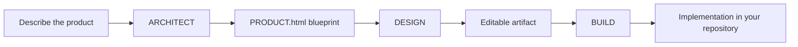

<div align="center">
  <h1>ZeroShot</h1>
  <p><strong>A local-first Codex workbench for turning product intent into running software.</strong></p>
  <p>
    <a href="https://github.com/keonho-kim/zeroShot/actions/workflows/release.yml">
      
    </a>
    <a href="https://github.com/keonho-kim/zeroShot/releases/tag/v0.0.0-dev.6">
      
    </a>
  </p>
</div>

## Product

ZeroShot is a desktop-friendly web console and CLI for working with Codex on your own projects.

It helps you move through a complete product workflow:



ZeroShot keeps the source of truth in your project directory, uses your existing `~/.codex` credentials, and records generated work inside the selected workspace.

## Highlights

- **ARCHITECT** turns a product brief into structured product decisions and a `PRODUCT.html` blueprint.
- **DESIGN** turns the blueprint into an editable artifact experience.
- **BUILD** asks Codex to implement the selected product direction inside your repository.
- **Local web console** for project selection, configuration, progress, logs, and artifact editing.
- **CLI included** for scripted or terminal-first workflows.
- **Release installer** for macOS, Linux, WSL, proot, and Termux-style environments.

## Installation

### Requirements

- Bun 1.3 or newer
- Codex credentials available through `~/.codex/auth.json`
- A project directory you want ZeroShot to work on

Termux users should install Bun before running the installer.

### Install

Install the latest dev release from npm:

```bash
npm install -g @keonhokim/zeroshot
```

Or install it with Bun:

```bash
bun install -g @keonhokim/zeroshot
```

ZeroShot runs on Bun, so Bun must be available even when the package is installed with npm.

Install a specific version:

```bash
npm install -g @keonhokim/zeroshot@0.0.0-dev.6
bun install -g @keonhokim/zeroshot@0.0.0-dev.6
```

The latest GitHub release installer is also available. It follows the newest ZeroShot release, regardless of whether the tag is dev or stable:

```bash
curl -fsSL https://github.com/keonho-kim/zeroShot/releases/latest/download/install.sh | sh
```

Use a pinned GitHub release when you need a specific version:

```bash
curl -fsSL https://github.com/keonho-kim/zeroShot/releases/download/v0.0.0-dev.6/install.sh | sh
```

Or install a pinned GitHub release package directly with Bun:

```bash
bun install -g https://github.com/keonho-kim/zeroShot/releases/download/v0.0.0-dev.6/zeroShot-0.0.0-dev.6.tgz
```

After installation, the `zeroshot` command is available on your PATH.

## CLI Commands

### `zeroshot start`

Start the web console:

```bash
zeroshot start
```

Open the printed local URL, usually:

```text
http://127.0.0.1:32575
```

Then:

1. Select a project folder.
2. Use **ARCHITECT** to create a product blueprint.
3. Continue to **DESIGN** when you want an editable artifact.
4. Use **BUILD** when the blueprint is ready to implement.

Bind the web console to a LAN or Tailscale-accessible interface:

```bash
zeroshot start --host 0.0.0.0 --port 32575
```

Options:

| Option | Purpose |
| --- | --- |
| `--host <host>` | Host interface to bind. Use `0.0.0.0` for LAN or Tailscale access. |
| `--port <port>` | Port to listen on. The default is `32575` unless overridden by config. |

### `zeroshot build`

Run a build directly from the terminal:

```bash
zeroshot build --project-root /absolute/path/to/project
```

BUILD starts a new product implementation run for the selected project. It uses the project `PRODUCT.html` blueprint and writes run history under `.work.history/`.

Common options:

| Option | Purpose |
| --- | --- |
| `--project-root <path>` | Required absolute path to the target project. |
| `--model <model>` | Override the Codex model for the run. |
| `--approval <policy>` | Override the Codex approval policy. |
| `--sandbox <mode>` | Override the Codex sandbox mode. |
| `--max-iters <count>` | Maximum implementation iterations. |
| `--add-dir <path>` | Additional directory Codex can read during the run. Can be repeated. |
| `--response-language <language>` | Language for user-facing run documents and final answers. |

### `zeroshot update`

Run an update flow:

```bash
zeroshot update --project-root /absolute/path/to/project
```

UPDATE compares `PRODUCT.html`, `UPDATE.md`, and the previous run history, then implements the requested changes. It accepts the same shared options as `build`.

### `zeroshot uninstall`

Remove ZeroShot global installs and local ZeroShot app data:

```bash
zeroshot uninstall
```

Preview the uninstall targets without deleting anything:

```bash
zeroshot uninstall --dry-run
```

Use `zeroshot uninstall` before `npm uninstall -g @keonhokim/zeroshot` or `bun uninstall -g @keonhokim/zeroshot` when you want a complete cleanup. Package-manager uninstall commands remove the package, but they do not remove app data such as `~/.zeroshot/config.toml`.

### Configuration

ZeroShot creates its app configuration at:

```text
~/.zeroshot/config.toml
```

Default configuration:

```toml
host = "127.0.0.1"
port = 32575
allowed_roots = []
default_approval = "never"
default_sandbox = "workspace-write"
max_iters = 30
stall_limit = 2
plan_reasoning = "high"
exec_reasoning = "medium"
validate_reasoning = "medium"
closeout_reasoning = "medium"
```

To allow access from another device on your private network:

```toml
host = "0.0.0.0"
port = 32575
```

Codex provider and profile settings remain in:

```text
~/.codex/config.toml
```

## Project Files

ZeroShot uses a small set of files in the selected project:

| File or directory | Purpose |
| --- | --- |
| `PRODUCT.html` | Product blueprint generated by ARCHITECT |
| `.work.history/` | Run history, logs, manifests, and generated outputs |
| Project source files | Files changed by BUILD or UPDATE |

## Run from Source

Clone the repository and install dependencies:

```bash
bun install
```

Start the development app:

```bash
bun run dev
```

Run checks:

```bash
bun run check
bun test
bun run build
```

Run backend and frontend separately:

```bash
bun run dev:server
bun run dev:web
```

## Release

Release builds are created by GitHub Actions when a release tag is pushed.

For dev releases:

```bash
git tag v0.0.0-dev.6
git push origin v0.0.0-dev.6
```

The release workflow uploads:

- `zeroShot-0.0.0-dev.6.tgz`
- `install.sh`

It also publishes the CLI package to npm as `@keonhokim/zeroshot`.

## Docker

Build the image:

```bash
docker build --no-cache -f docker/Dockerfile -t zeroshot .
```

Run it with a mounted home directory so Codex credentials and project files persist:

```bash
docker run --rm \
  -p 32575:32575 \
  -v "$HOME/.codex:/root/.codex" \
  -v "$HOME/dev:/root/workspace" \
  zeroshot
```

Open `http://127.0.0.1:32575` and choose a project under `/root/workspace`.

## Status

ZeroShot is under active development. Prefer tagged releases for installation, and keep project work in version control before running BUILD or UPDATE.
